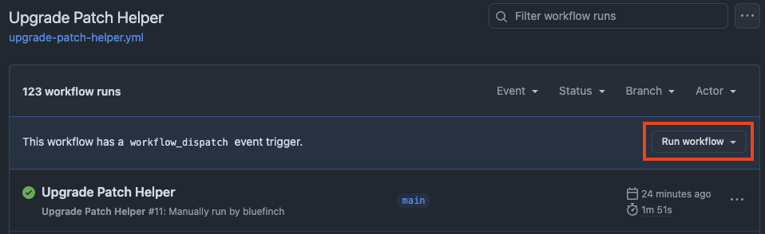
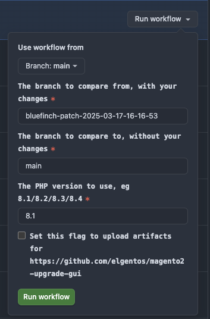
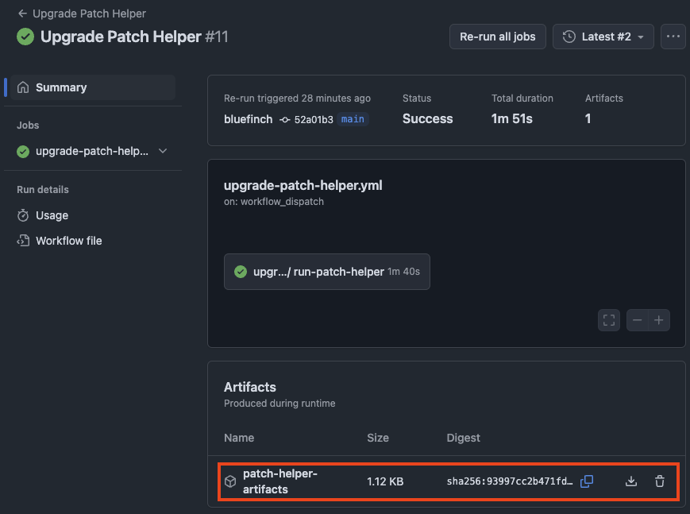

# bluefinch-upgrade-patch-helper-github-action

This GitHub action automates the running of https://github.com/AmpersandHQ/ampersand-magento2-upgrade-patch-helper

You can manually run the upgrade patch helper by following the instructions [here](https://github.com/AmpersandHQ/ampersand-magento2-upgrade-patch-helper?tab=readme-ov-file#how-to-use).

# Installation

In your repository create a `.github/workflows/upgrade-patch-helper.yml` on the **default branch** with the following contents

```yml
name: Upgrade Patch Helper

on:
  workflow_dispatch:
    inputs:
      branch-to-compare-from:
        description: 'The branch to compare from, with your changes'
        type: string
        required: true
      branch-to-compare-to:
        description: 'The branch to compare to, without your changes'
        type: string
        required: true
      php-version:
        description: 'The PHP version to use, eg 8.1/8.2/8.3/8.4'
        required: true
        type: string
      with-gui-artifacts:
        description: "Set this flag to upload artifacts for https://github.com/elgentos/magento2-upgrade-gui"
        type: boolean
        required: true
        default: false

jobs:
  upgrade-patch-helper:
    uses: bluefinchcommerce/upgrade-patch-helper-github-action/.github/workflows/upgrade-patch-helper.yml@1.0.0
    with:
      branch-to-compare-from: ${{ inputs.branch-to-compare-from }}
      branch-to-compare-to: ${{ inputs.branch-to-compare-to }}
      php-version: ${{ inputs.php-version }}
      with-gui-artifacts: ${{ inputs.with-gui-artifacts }}
    secrets:
      composer-auth: '${{ secrets.COMPOSER_AUTH }}'
```

## Authentication

To run the `composer install` commands a valid `auth.json` needs to be provided. 

1. Please read the [official Adobe documentation](https://experienceleague.adobe.com/en/docs/commerce-on-cloud/user-guide/develop/authentication-keys) detailing the usage of `auth.json`
2. Follow the [official GitHub documentation](https://docs.github.com/en/actions/security-for-github-actions/security-guides/using-secrets-in-github-actions#creating-secrets-for-a-repository) and add a `COMPOSER_AUTH` secret containing a valid `auth.json`

3. This `COMPOSER_AUTH` secret is only ever used to create a `~/.composer/auth.json` file within your GitHub action runner.

# Usage

You can manually trigger executions of the patch helper by following this process.

1. On the top of your repository click "Actions"
2. On the left hand side below "All workflows" click "Upgrade Patch Helper"
3. You will see the following interface, on the right hand side click "Run workflow"
    

4. Fill in the requested details and click "Run workflow"

    

5. The page will refresh and not show anything. Give it a few seconds then refresh the page again. You should see a running job indicated by an orange icon. Click into that job.
6. Once the job completes you will be able to see the artifacts available for download
    

7. Review each `WARN` entry against alongside the [patch helper documentation](https://github.com/AmpersandHQ/ampersand-magento2-upgrade-patch-helper/blob/master/docs/CHECKS_AVAILABLE.md).
